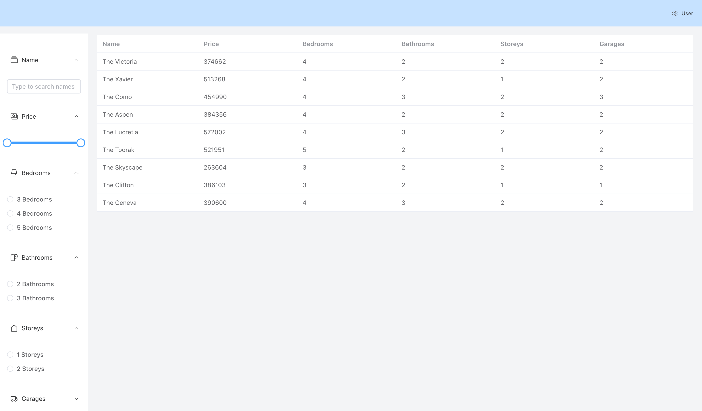

# Hicaliber-test


## Background

This project demonstrates a wide range of technologies commonly used in the company, focusing on a full-stack web application using PHP (Laravel), Vue.js, MySQL, Element UI, and Tailwind CSS. The goal is to showcase not only task completeness and code quality but also the integration of these technologies in creating a responsive and functional application.


.png)
.png)



## Project Setup

### Requirements

- PHP >= 8.2
- MySQL >= 8.0
- Composer
- npm

### Installation

Clone the repository:

```bash
git clone https://github.com/kguskov/Hicaliber-test.git
```

Navigate to the Project Directory

After cloning, navigate to the project directory.

```bash
cd Hicaliber-test
```

## Start the Docker Environment

### Use Laravel Sail to start the Docker environment.

```bash
./vendor/bin/sail up -d
```

This command builds and starts the containers specified in your Docker Compose file.

## Install Dependencies

### Install PHP dependencies.

```bash
./vendor/bin/sail composer install
```

### Set up the environment file
```bash
cp .env.example .env
# Modify the .env file with your database credentials
```

### Run migrations and seeders

```bash
./vendor/bin/sail artisan migrate --seed
```

## Install frontend dependencies
```bash
npm install
```
## Serve the application
In a new terminal
```bash
npm run dev
```

## Running Tests

### To run tests in the Docker environment, use the following command:

```bash
./vendor/bin/sail artisan test
```
This will execute the Laravel test suite within the Docker container.

## API Endpoint: `api/properties`

This endpoint allows for searching properties based on various criteria such as name, number of bedrooms, bathrooms, storeys, garages, and price range. All search parameters are optional, enabling flexible and powerful search capabilities.

### Request Parameters

- `name`: (string) Partial or full name of the property.
- `bedrooms`: (integer) Exact number of bedrooms.
- `bathrooms`: (integer) Exact number of bathrooms.
- `storeys`: (integer) Exact number of storeys.
- `garages`: (integer) Exact number of garages.
- `min_price`: (integer) Minimum price range.
- `max_price`: (integer) Maximum price range.

### Example Requests

**Request 1**: Search for properties with at least 2 bedrooms and 2 bathrooms.

```http
GET /api/properties?bedrooms=2&bathrooms=2
```

### Example Responses
**Response 1**: For a search query with at least 2 bedrooms and 2 bathrooms.

```json
{
  "properties": [
    {
      "id": 1,
      "name": "Sunset Villa",
      "bedrooms": 2,
      "bathrooms": 2,
      "storeys": 1,
      "garages": 1,
      "price": 350000
    },
    {
      "id": 2,
      "name": "Dawn Cottage",
      "bedrooms": 2,
      "bathrooms": 2,
      "storeys": 2,
      "garages": 2,
      "price": 450000
    }
  ]
}
```
**Request 2**: Search for properties named "Villa" with a price range between $100,000 and $500,000.
```http
GET /api/properties?name=Villa&min_price=100000&max_price=500000
```

**Response 2**: For a search query for properties named "Villa" with a price range between $100,000 and $500,000.
```json
{
  "properties": [
    {
      "id": 3,
      "name": "Villa Sunrise",
      "bedrooms": 3,
      "bathrooms": 2,
      "storeys": 2,
      "garages": 2,
      "price": 300000
    },
    {
      "id": 4,
      "name": "Villa Sunset",
      "bedrooms": 4,
      "bathrooms": 3,
      "storeys": 2,
      "garages": 2,
      "price": 400000
    }
  ]
}
```
**Response** when no properties match the search criteria:
```json
{
  "properties": []
}
```

### Notes
The response includes an array of properties that match the search criteria. Each property object includes details such as id, name, bedrooms, bathrooms, storeys, garages, and price.
A search with no matching properties will return an empty array for properties.
